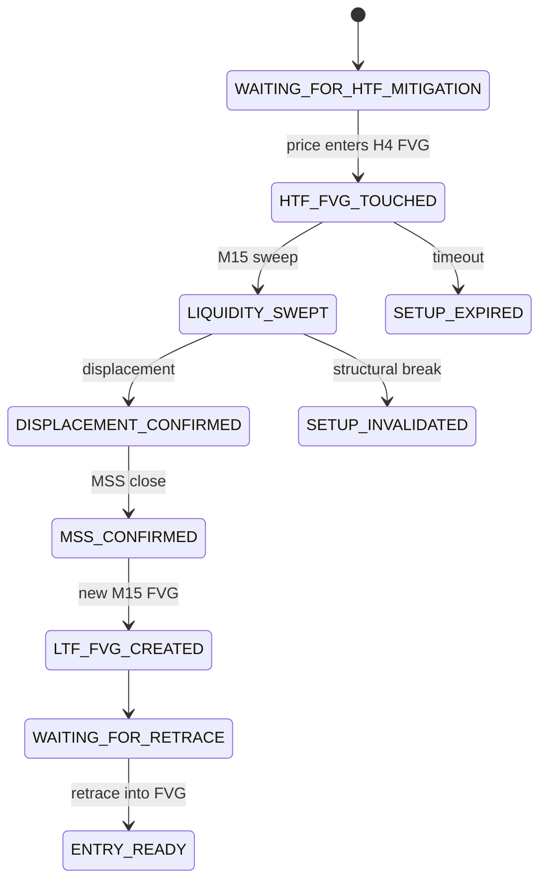

# H4 → M15 FVG Strategy Implementation

**Date:** 2026-08-14  
**Status:** Phase 1–7 delivered (Python canonical orchestration)  
**Trade execution:** Disabled — stops at `ENTRY_READY`

---

## 1. Objective

Unified orchestration for:

```text
H4 FVG (location) → H4 touch → M15 liquidity sweep → displacement → MSS → new M15 FVG → retrace → ENTRY_READY
```

Reuses canonical FVG math from `market_structure/fvg.py` and ICT liquidity/sweep helpers. Does **not** replace Gold SMC, ICT, AMD iFVG, or Pullback V2.

---

## 2. Architecture

```text
POST /api/v1/h4-m15-fvg/analyze
        ↓
analyze_h4_m15_fvg (service.py)
        ↓
H4M15Engine (engine.py)
  ├─ bootstrap_h4 → detect_fvgs(H4)
  └─ process_m15_bar (per closed M15)
        ├─ apply_candle_mitigation (H4 zone)
        ├─ detect_liquidity_sweep (after htf touch)
        ├─ displacement_ok
        ├─ detect_mss
        ├─ select_execution_fvg (strict chronology)
        └─ retrace → ENTRY_READY
        ↓
explain.py + store.py (SQLite)
```

**MQL5:** Not duplicated in this phase. MT5 remains data/heartbeat; analysis runs in Python.

---

## 3. Canonical FVG Model

Extended `FvgZone` in `market_structure/types.py`:

- Lifecycle: `FRESH`, `TOUCHED`, `PARTIALLY_MITIGATED`, `MIDPOINT_REACHED`, `FULLY_MITIGATED`, `INVALIDATED`, `EXPIRED`
- Metadata: `first_touch_time`, `midpoint_touch_time`, `parent_fvg_id`, candle times, `gap_atr`

---

## 4. H4 FVG Detection

`H4M15Engine.bootstrap_h4()` calls `detect_fvgs(..., timeframe="H4", min gap = min_h4_fvg_atr)`.

Setup ID: `H4M15-{SYMBOL}-{B|S}-{formation_time}`

---

## 5. Mitigation Lifecycle

`apply_candle_mitigation()` updates wick penetration, CE touch, optional close invalidation.

H4 touch on M15: `candle.low <= h4.upper` (bullish).

---

## 6. M15 Liquidity Sweep

Reuses `analysis/ict/sweep.py` with `after_time=htf_first_touch_time`.

---

## 7. Displacement Confirmation

`displacement_ok()` — configurable `min_body_ratio`, `min_range_atr_ratio`.

---

## 8. MSS / BOS Confirmation

Reuses `detect_mss()` + `find_swings()` on closed M15 history only.

---

## 9. M15 Execution FVG

`select_execution_fvg()` enforces:

```text
formation_time >= htf_touch
formation_time >= sweep (if set)
formation_time >= displacement (if set)
formation_time >= mss - causal_window
direction == setup.direction
```

---

## 10. State Machine

States in `H4M15SetupState` — see `types.py`.

Critical rule: M15 confirmation only after `htf_first_touch_time`.

---

## 11. Entry Ready Logic

`WAITING_FOR_RETRACE` → price in M15 execution FVG → `ENTRY_READY` (no OrderSend).

Configurable `retrace_mode`: `TOUCH`, `MIDPOINT`, `25_PERCENT`.

---

## 12. Invalidation

- H4 close beyond zone (optional)
- Close beyond sweep ± `sl_buffer_atr * ATR`

---

## 13. Setup Expiration

- `max_confirmation_m15_bars` since H4 touch
- `max_retrace_m15_bars` after LTF FVG

---

## 14. Scoring

Weighted 0–100 in `score_setup()` — grades `LOW` … `A_PLUS`.

---

## 15. Persistence

SQLite: `backend/data/h4_m15_fvg.db`

Tables: `fvg_zones`, `fvg_setups`

---

## 16. Explainability

- JSON: `setup_to_json()`
- Text: `setup_to_text()`
- Transition log on each state change

---

## 17. Testing

`tests/test_h4_m15_fvg.py` — detection, mitigation, chronology, replay, API shape.

Run:

```bash
cd backend && python -m pytest tests/test_h4_m15_fvg.py -q
```

---

## 18. API Changes

| Method | Path |
|--------|------|
| GET | `/api/v1/h4-m15-fvg/status` |
| POST | `/api/v1/h4-m15-fvg/analyze` |
| POST | `/api/v1/strategy/h4-m15-fvg/analyze` |
| GET | `/h4-m15-fvg` (desk UI) |

**Heartbeat:** EA sends `h4_m15_fvg_candles` on each new closed M15 bar; backend runs Python analyze and stores `h4_m15_fvg` blob in monitor store.

Example body:

```json
{
  "symbol": "EURUSD",
  "candles": {
    "H4": [{"t": 1, "o": 1.08, "h": 1.09, "l": 1.07, "c": 1.085}],
    "M15": [{"t": 100, "o": 1.08, "h": 1.081, "l": 1.079, "c": 1.08}]
  },
  "config": { "min_h4_fvg_atr": 0.10 }
}
```

---

## 19. Configuration

`H4M15FvgConfig` in `analysis/h4_m15_fvg/types.py` — all thresholds configurable via POST `config` object.

---

## 20. Known Limitations

- Session scoring weight reserved but not wired to session module yet
- MQL5 exports candles only (no local state machine parity)
- Full live validation requires EA attached with `InpH4M15FvgEnable=true`

---

## 21. Next Development Phase

1. Optional MQL5 state-machine parity (deferred — Python remains canonical)
2. ~~Signal Center integration~~ — Phase D advisory cards (read-only; no `signal_ledger` writes)
3. ~~Session scoring weight wiring~~ — Phase D (`score_setup` session heuristic)

---

## 23. Phase D — Signal Center, Confluence & Session Scoring

### Signal Center advisory cards (read-only)

- `backend/app/analysis/h4_m15_fvg/advisory_cards.py` — builds cards from `ea.h4_m15_fvg.primary` when `ENTRY_READY`
- `GET /api/v1/signals` — adds `advisory_cards` and `advisory_card_count` (does **not** write to `signal_ledger`)
- `backend/app/static/signals.html` — second section with link to `/h4-m15-fvg`

### Confluence integration

- `normalize.py` — `H4_M15_FVG` strategy signal when module valid; active only on `ENTRY_READY`
- `weights.py` — default weight `0.88`
- `master_verdict.py` — `H4→M15` module chip on monitor

### Session scoring

- `engine.score_setup()` — applies `weight_session` via ICT session heuristic (70 LONDON/NY, 40 OFF_HOURS) using `entry_ready_time` or bar time

### Tests

- `backend/tests/test_h4_m15_fvg_phase_d.py` — advisory cards API, confluence normalize, master chip, session boost

---

## 22. Phase C — Replay CLI & Discord

### Replay CLI

```bash
cd backend
python -m app.analysis.h4_m15_fvg.replay --symbol EURUSD --h4-csv data/h4.csv --m15-csv data/m15.csv --incremental --out result.json
python -m app.analysis.h4_m15_fvg.replay --candles-json fixtures/eurusd.json --no-persist
```

CSV columns: `time,open,high,low,close` (aliases: `timestamp`, `o/h/l/c`).

### Discord ENTRY_READY alerts

Environment variables (`.env`):

```env
DISCORD_H4_M15_FVG_ALERTS_ENABLED=true
DISCORD_H4_M15_FVG_WEBHOOK_URL=https://discord.com/api/webhooks/...
DISCORD_H4_M15_FVG_MIN_SCORE=50
DISCORD_H4_M15_FVG_COOLDOWN_SEC=300
DISCORD_H4_M15_FVG_ALERT_EVENTS=ENTRY_READY,SETUP_INVALIDATED,SETUP_EXPIRED
```

Alerts fire on state change only (`state_changed=true`). Wired on heartbeat (after Python analyze) and `/h4-m15-fvg/analyze`.

---

## State Machine Diagram



---

## Files Created

| File | Purpose |
|------|---------|
| `backend/app/analysis/h4_m15_fvg/types.py` | Config, states, setup model |
| `backend/app/analysis/h4_m15_fvg/engine.py` | State machine orchestration |
| `backend/app/analysis/h4_m15_fvg/service.py` | Analyze entry point |
| `backend/app/analysis/h4_m15_fvg/explain.py` | JSON + text explanations |
| `backend/app/analysis/h4_m15_fvg/store.py` | SQLite persistence |
| `backend/tests/test_h4_m15_fvg.py` | Unit/integration tests |
| `docs/FVG_H4_M15_IMPLEMENTATION.md` | This document |

## Files Modified

| File | Change |
|------|--------|
| `market_structure/types.py` | Extended FvgZone + lifecycle enums |
| `market_structure/fvg.py` | make_fvg_id, apply_candle_mitigation, CE tracking |
| `routers/api.py` | H4-M15 FVG endpoints |
| `tests/test_market_structure.py` | MIDPOINT_REACHED assertion |

## Intentionally Untouched

- `VantageGoldSMCZones.mqh`, `VantageIct.mqh`, Pullback V2, AMD iFVG, Box Theory
- Existing ICT `/analyze` behavior
- `signal_ledger` schema
