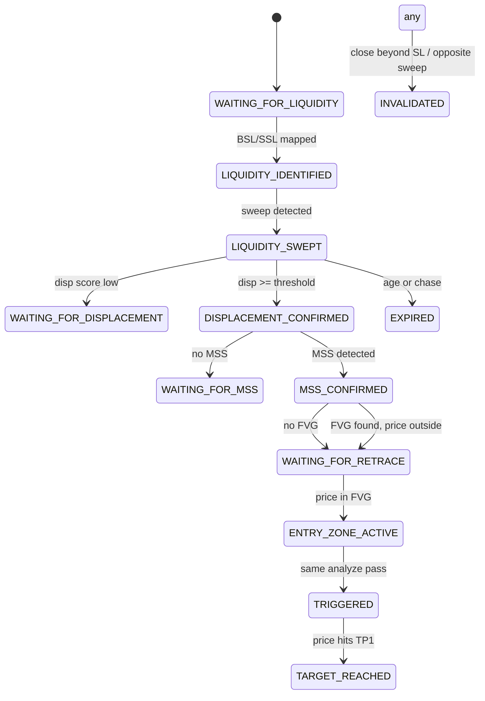

# ICT Strategy Forensic Audit

**Repository:** `vantage_mt5_ai_decision_assistant`  
**Audit date:** 2026-07-29  
**Scope:** Read-only evaluation — no trading logic modified  
**Canonical Python path:** `backend/app/analysis/ict/`  
**Live monitor path (default):** MQL5 `VantageIct.mqh` via EA heartbeat  

---

## 1. Executive Summary

The repository implements an **ICT-style multi-timeframe setup engine** with two parallel implementations:

| Layer | Role |
|-------|------|
| **Python** (`analysis/ict/`) | Canonical, richer logic: multi-level liquidity, 20-bar sweep scan, state persistence, scoring gates, explainability |
| **MQL5** (`VantageIct.mqh`) | Live heartbeat blob; simplified single-bar sweep, different MSS/FVG rules, no causal FVG timestamp filter |
| **Frontend** (`static/ict.html`) | Polls `/api/v1/ict/status`; displays EA passthrough or backend fallback |

**Actual strategy flow (Python, from code):**

```text
D1/H4/H1 bias (close drift vote)
    → M15 liquidity map (swings, EQH/EQL, PDH/PDL proxy)
    → M15 liquidity sweep (most recent in last 20 bars)
    → M15 displacement (best post-sweep candle score)
    → M15 MSS (last bar breaks last swing high/low)
    → M5 FVG (candles with time >= sweep_time; latest matching direction)
    → Retrace / zone touch (bid or last close)
    → TRIGGERED → BUY/SELL if score ≥ 70 and RR ≥ 2.0
```

This is **not** a fully causal ICT institutional model. Individual ICT concepts exist (sweep, displacement, MSS, FVG, PD), but **chronological binding between displacement, MSS, and FVG is weak**. MQL5 diverges materially from Python.

**Classification:** **FUNCTIONAL** (analysis-only advisory) — not production-ready for automated signal generation.

| Verdict | Summary |
|---------|---------|
| **Trading logic** | Recognizable ICT scaffold; missing OTE, kill zones, BOS/CHoCH, order blocks; causal chain incomplete |
| **Engineering** | Modular Python, good explainability payload, state merge; in-memory persistence; no replay CLI |
| **Backtest safety** | Closed-bar discipline in Python; pivot confirmation lag acceptable; **no incremental replay/look-ahead tests** |
| **Live trading readiness** | **Not ready** — advisory only by design; Python vs MQL5 parity gap; TRIGGERED can fire on same analyze pass as FVG detection |

**Overall score:** **96 / 170** → **56 / 100** (normalized)

---

## 2. Current ICT Architecture

### 2.1 Architecture map

```text
┌─────────────────────────────────────────────────────────────────────────┐
│ DATA SOURCE                                                             │
│  • POST /api/v1/ict/analyze — closed OHLC by TF (Python engine)         │
│  • EA heartbeat — MQL5 Evaluate() → "ict" JSON (monitor default)        │
└─────────────────────────────────────────────────────────────────────────┘
                                    ↓
┌─────────────────────────────────────────────────────────────────────────┐
│ CANDLE ACQUISITION                                                      │
│  Python: validate_candles(), min 60 M15 bars, M5 execution TF           │
│  MQL5: CopyRates(tf, 1, count) — shift 1 = closed bars only             │
└─────────────────────────────────────────────────────────────────────────┘
                                    ↓
┌─────────────────────────────────────────────────────────────────────────┐
│ HTF BIAS — bias.py + market_structure/bias.py                           │
│  D1, H4, H1 weighted vote → BULLISH / BEARISH / NEUTRAL                 │
└─────────────────────────────────────────────────────────────────────────┘
                                    ↓
┌─────────────────────────────────────────────────────────────────────────┐
│ LIQUIDITY — liquidity.py + swings.py                                    │
│  BSL/SSL/EQH/EQL + PDH/PDL proxy on M15                                 │
└─────────────────────────────────────────────────────────────────────────┘
                                    ↓
┌─────────────────────────────────────────────────────────────────────────┐
│ SWEEP — sweep.py (Python) | VantageIct.mqh L239–265 (MQL5)              │
│  M15 closed-bar sweep + reclaim                                         │
└─────────────────────────────────────────────────────────────────────────┘
                                    ↓
┌─────────────────────────────────────────────────────────────────────────┐
│ DISPLACEMENT — displacement.py + models/bullish|bearish.py              │
│  Best post-sweep M15 candle by score_displacement()                     │
└─────────────────────────────────────────────────────────────────────────┘
                                    ↓
┌─────────────────────────────────────────────────────────────────────────┐
│ MSS — market_structure/structure.py detect_mss()                        │
│  Last M15 bar body breaks last swing (not BOS/CHoCH)                    │
└─────────────────────────────────────────────────────────────────────────┘
                                    ↓
┌─────────────────────────────────────────────────────────────────────────┐
│ FVG — market_structure/fvg.py on M5 exec candles (time >= sweep)        │
│  Latest directional FVG → entry zone                                    │
└─────────────────────────────────────────────────────────────────────────┘
                                    ↓
┌─────────────────────────────────────────────────────────────────────────┐
│ ENTRY — entry.py, _apply_entry_state()                                  │
│  Price in zone → ENTRY_ZONE_ACTIVE → TRIGGERED (same pass)              │
└─────────────────────────────────────────────────────────────────────────┘
                                    ↓
┌─────────────────────────────────────────────────────────────────────────┐
│ SL/TP — risk.py, targets.py                                             │
│  SL: sweep extreme ± sl_buffer_atr; TP1=1R, TP2=internal liquidity      │
└─────────────────────────────────────────────────────────────────────────┘
                                    ↓
┌─────────────────────────────────────────────────────────────────────────┐
│ SCORING — scorer.py → decide_from_score()                               │
│  Weighted 0–100; gates for sweep/disp/MSS/FVG                           │
└─────────────────────────────────────────────────────────────────────────┘
                                    ↓
┌─────────────────────────────────────────────────────────────────────────┐
│ SIGNAL / API / UI                                                       │
│  • state_store (in-memory) + history deque                              │
│  • GET /api/v1/ict/status, /ict dashboard                               │
│  • Confluence normalize "ICT" weight 1.0                                │
│  • Discord ict_discord_notify (state_changed)                           │
│  • NOT in signal_ledger (M5 desk only)                                  │
└─────────────────────────────────────────────────────────────────────────┘
```

### 2.2 Layer reference table

| Layer | Python file | Key function | TF | Inputs | Outputs |
|-------|-------------|--------------|-----|--------|---------|
| Orchestration | `service.py` | `analyze_ict_strategy()` | M15/M5 | OHLC map, bid | Full JSON payload |
| HTF bias | `bias.py` | `compute_htf_bias()` | D1/H4/H1 | Per-TF candles | direction, conf, evidence |
| Liquidity | `liquidity.py` | `build_liquidity_levels()` | M15 | swings, ATR | BSL[], SSL[] |
| Sweep | `sweep.py` | `detect_liquidity_sweep()` | M15 | levels, candles | `LiquiditySweepEvent` |
| Sequence | `models/bullish.py` / `bearish.py` | `evaluate_*_sequence()` | M15/M5 | ctx, candles | updated `IctSetupContext` |
| MSS | `structure.py` | `detect_mss()` | M15 | swings, last bar | mss dict |
| FVG | `fvg.py` | `detect_fvgs()` | M5 | filtered candles | `FvgZone[]` |
| State | `state_machine.py` | `merge_state`, checks | — | ctx, candles | state transitions |
| Score | `scorer.py` | `score_ict_setup()` | — | ctx, RR | score, gates |
| Persist | `state_store.py` | `save_setup()` | — | `IctSetupRecord` | in-memory |
| MQL5 | `VantageIct.mqh` | `Evaluate()` | H1/M15/M5 | CopyRates closed | `VantageIctResult` → JSON |

---

## 3. Actual Strategy Flow

Reconstructed **strictly from Python** (`service.py` + `models/bullish.py`):

```text
1. Symbol gate (XAUUSD, EURUSD, USDJPY desk-approved)
2. HTF bias from D1/H4/H1 (20-bar close drift, weighted vote)
3. Map M15 BSL/SSL (+ EQH/EQL, PDH/PDL proxy)
4. If no BSL/SSL → LIQUIDITY_IDENTIFIED at best; pipeline may stop at sweep
5. detect_liquidity_sweep — most recent event in last 20 M15 bars
   • BSL: high > level + pen, close < level (bearish)
   • SSL: low < level - pen, close > level (bullish)
6. If no sweep → return early (no displacement/MSS/FVG)
7. Premium/discount on last 48 M15 bars vs current price
8. Bullish: SSL sweep → post-sweep displacement → MSS → M5 bullish FVG → retrace
   Bearish: BSL sweep → symmetric
9. merge_state with persisted setup (same setup_id)
10. SL/TP, invalidation, expiration, target checks
11. Score + decision (BUY/SELL only at TRIGGERED + gates + score + RR)
```

**Effective model:**

```text
HTF context (D1/H4/H1 vote)
→ M15 liquidity sweep (defines trade_bias)
→ M15 displacement (scored candle after sweep)
→ M15 MSS (last bar vs last swing)
→ M5 FVG (post-sweep timestamp filter)
→ retrace into FVG
→ advisory BUY/SELL at TRIGGERED
```

**Not implemented:** OTE, kill zones as filters, order blocks, breaker blocks, CHoCH/BOS taxonomy, iFVG entry model, HTF FVG anchor (that is the separate H4→M15 engine).

---

## 4. Higher-Timeframe Bias

**Location:** `bias.py`, `market_structure/bias.py`

**Per-TF formula** (`htf_bias`):

```text
Compare closes[-1] vs closes[0] over last 20 bars:
  BULLISH if closes[-1] > closes[0] * 1.002
  BEARISH if closes[-1] < closes[0] * 0.998
  else NEUTRAL
```

**Aggregation** (`compute_htf_bias`):

```text
Weights: D1=3.0, H4=2.5, H1=2.0
BULLISH if bull > bear * 1.2 → confidence = min(100, 50 + bull/total*50)
BEARISH if bear > bull * 1.2
else NEUTRAL, confidence 45
```

**MQL5:** H1 close vs 20-bar mean only; fixed confidence 65 (`VantageIct.mqh` L203–210).

| Assessment | |
|------------|--|
| Deterministic | Yes |
| Structurally meaningful | **Partial** — not true MSS/BOS on HTF |
| Overly simplistic | **Yes** — drift-only, no dealing range |
| Duplicated | Similar pattern in `market_structure/bias.py` used elsewhere |

**Severity:** **MEDIUM** — HTF bias is contextual/scoring, not a hard gate (except optional countertrend penalty).

---

## 5. Liquidity Identification

**Location:** `liquidity.py`

| Source | Implementation |
|--------|----------------|
| Swing highs/lows | Last 6 pivot highs → BSL, last 6 lows → SSL |
| Equal highs/lows | Pairwise within `equal_high_low_tolerance_atr * ATR` (0.10) |
| PDH/PDL | Max/min over last 96 M15 bars (or 24 if shorter) — **not true calendar day** |
| Previous week | **Missing** |
| Session highs/lows | **Missing** (session module separate, not wired to levels) |

Levels are **stored objects** (`LiquidityLevel` dataclass), deduped by price tolerance.

**Weak vs strong differentiation:** Only via swing `min_atr` filter (0.3× ATR bar range). No external/internal liquidity taxonomy.

**MQL5:** Single highest BSL + lowest SSL from pivot scan — **not equivalent** to Python map.

**Severity:** **MEDIUM** — PDH/PDL label is misleading (rolling window, not broker midnight).

---

## 6. Liquidity Sweep Logic

**Location:** `sweep.py`

### Bullish (SSL / sell-side sweep)

```text
penetration = level - candle.low
min_pen <= penetration <= max_pen   (0.05–0.75 ATR default)
candle.close > level                (reclaim)
sweep_type = SELL_SIDE
trade_bias = BULLISH
```

### Bearish (BSL / buy-side sweep)

```text
penetration = candle.high - level
min_pen <= penetration <= max_pen
candle.close < level
trade_type = BUY_SIDE
trade_bias = BEARISH
```

**Reclaim:** Required via close back inside (`sweep_require_reentry=True` by default).

**Quality:** `55 + (wick/body)*15 + (pen/atr)*20`, capped 100.

**Scan window:** Last 20 closed M15 bars; picks **most recent** matching event.

**Not a sweep:** Simple `low < swing_low` without reclaim and penetration band → **rejected** (correct).

**MQL5 limitation:** Only **latest M15 bar** tested — sweeps 2–19 bars ago missed.

| Finding | Severity |
|---------|----------|
| Python sweep logic sound | INFORMATIONAL |
| MQL5 single-bar window | **HIGH** |
| Stale level reuse | LOW — levels rebuilt each analyze |

---

## 7. Displacement

**Location:** `market_structure/displacement.py`, used in `models/bullish.py` L31–39

**Selection:** Among M15 candles with `time >= sweep.sweep_time`, pick candle with **maximum** `score_displacement()`.

**Formula:**

```text
score = min(100,
  min(25, body/atr * 25)
+ min(15, body/range * 15)
+ 25 if structure_break else 0    ← always False in ICT path
+ 15 if fvg_created else 0        ← always False in ICT path
+ 10 if bullish close in top 25% of range (or bear bottom 25%)
)
```

**Threshold:** `displacement_min_score = 50.0` (default)

**Problem:** With `structure_break=False` and `fvg_created=False`, max from body metrics ≈ **40**; directional close bonus adds up to **10** → practical max **50**. Threshold of 50 is at the edge; tests use 35 (`test_ict_logic.py`).

| Assessment | |
|------------|--|
| Binary vs scored | Scored with binary gate at 50 |
| Direction-aware | Via close location bonus |
| Multi-candle | Yes — searches all post-sweep bars |
| Normal volatility false positives | **Possible** at threshold 50 |

**MQL5:** Displacement = **same bar as sweep** only; body ≥ `disp_min_body_atr * ATR`.

**Severity:** **HIGH** — displacement not proven to be the impulse leg leading to MSS; MSS uses different candle (last bar on full series).

---

## 8. Swing Detection

**Location:** `market_structure/swings.py`

```text
Pivot at i requires left=2, right=2 bars confirmation
Swing high: hi >= neighbors; bar range >= min_atr * ATR (0.3 default)
```

**Look-ahead:** Pivot at index `i` only known after `i+right` bars close — **correct**, no future leak if swings consumed only on closed history.

**Weaknesses:** Micro swings in flat markets; equal highs as separate EQH levels; large spike bars dominate.

**MQL5:** Same pivot logic but **no ATR minimum** on swing bar range.

**Severity:** **MEDIUM** — swing choice directly affects MSS broken level.

---

## 9. MSS / BOS / CHoCH

### Implemented: MSS only (`structure.py`)

**Bearish MSS:**

```text
last = candles[-1]
body_lo = min(open, close)
body / atr >= displacement_min_body_atr * 0.5  (0.4 ATR default)
body_lo < last_swing_LOW price → shift_detected
confirmation_type = "BODY_CLOSE"
```

**Bullish:** symmetric with `body_hi > last_swing_HIGH`

### BOS / CHoCH

**Not implemented** anywhere in ICT module. UI labels elsewhere may say "MSS/BOS" but code has no BOS/CHoCH detectors.

### Critical chronology issue

MSS runs on **full** `setup_candles` last bar, **not** scoped to post-sweep or post-displacement window. A slow grind can break last swing unrelated to the sweep impulse.

| Concept | Code definition | Expected ICT role | Inconsistency |
|---------|-----------------|-------------------|---------------|
| MSS | Body break last pivot swing | Post-sweep structure shift | **Not tied to sweep/displacement candle** |
| BOS | N/A | Continuation break | Missing |
| CHoCH | N/A | Reversal character | Missing |

**Severity:** **HIGH** — MSS can confirm without meaningful post-sweep displacement linkage.

---

## 10. FVG Execution Logic

**Canonical 3-candle model** (`fvg.py`):

```text
Bullish: c3.low > c1.high, gap >= fvg_min_gap_atr * ATR
Bearish: c3.high < c1.low
Zone: bull [c1.high, c3.low]; created_time = c3.time
```

**ICT execution TF:** M5 (`primary_execution_timeframe`)

**Selection** (`bullish.py` L57–69):

```python
fvgs = detect_fvgs([c for c in exec_candles if c.time >= sweep.sweep_time], ...)
ctx.fvg = bull_fvgs[-1]  # most recent
```

**Mitigation tracking:** `FvgZone` supports mitigation in `fvg.py` but ICT path does not gate entry on mitigation state.

**iFVG:** Not used in ICT entry model.

---

## 11. Post-Sweep FVG Validation

### Python ICT

- Pre-filters execution candles: `time >= sweep.sweep_time`
- Implicit: any detected FVG has `created_time >= sweep_time` (all pattern candles post-filter)
- **Does not** require `created_time >= displacement_time` or `>= mss_time`
- **Does not** exclude FVG formed before MSS while after sweep

### MQL5 ICT

- **No timestamp filter** — scans last 12 M5 bars after MSS state
- Pre-sweep M5 FVG can attach to post-sweep setup in same `Evaluate()` pass

### Reference (strictest in repo)

`h4_m15_fvg/engine.py` `select_execution_fvg()` enforces sweep → displacement → MSS floors.

| Implementation | Post-sweep FVG | Post-MSS FVG |
|----------------|----------------|--------------|
| Python ICT | Partial (>= sweep) | **No** |
| MQL5 ICT | **No** | **No** |
| H4→M15 engine | Yes | Yes |

**Severity:** **HIGH (MQL5)**, **MEDIUM (Python)** — causal execution imbalance not fully enforced.

---

## 12. FVG Retracement

**Location:** `models/bullish.py` `_apply_entry_state()`

```text
Entry zone = FVG lower/upper (build_entry_zone)
Retrace mode: TOUCH — price inside [zone_low, zone_high]
Price source: bid or setup[-1].close
If in zone → ENTRY_ZONE_ACTIVE → immediately TRIGGERED (same call)
If price > zone_high + chase_max_atr * atr → EXPIRED
Else → WAITING_FOR_RETRACE
```

**No** 25%/50% CE/midpoint modes in ICT (contrast H4→M15 engine).

**Pre-MSS FVG touch:** FVG only selected after MSS step; price interaction evaluated after FVG found — **cannot** enter before MSS in same pass, but **can** TRIGGER without separate retrace confirmation candle.

**Severity:** **MEDIUM** — instant TRIGGERED on touch is aggressive for backtest/live parity.

---

## 13. Premium / Discount

**Location:** `premium_discount()` on dealing range from **last 48 M15 bars**:

```text
range_high = max(high), range_low = min(low)
equilibrium = midpoint
Classify current price → DEEP_PREMIUM / PREMIUM / DISCOUNT / DEEP_DISCOUNT / NEUTRAL
```

**Used in scoring only** (`use_premium_discount=True`); not a hard entry filter.

**Stability:** Range moves every bar → PD label can flip on ranging price.

**OTE:** **Not implemented** in ICT module (grep: no OTE/62%/70.5%/79%).

**Severity:** **MEDIUM** — moving dealing range causes historical inconsistency.

---

## 14. OTE

**Status:** **Missing**

No Optimal Trade Entry band, fib retracement, or 62–79% filter in `analysis/ict/`.

---

## 15. Sessions / Kill Zones

**Location:** `session.py`

```text
UTC hour buckets (hard-coded):
  ASIA:   0–8
  LONDON: 7–16
  NEW_YORK: 12–21
Timezone: cfg.session_timezone default "UTC"
```

**Scoring:** `session_score = 70` if LONDON or NEW_YORK else 40; `use_session_filter=False` by default → session contributes fixed 60% of weight (3 points).

**Kill zones (London Open, NY Open, overlap as filters):** **Not implemented** as hard gates.

**DST:** No America/New_York DST handling unless user changes `session_timezone`.

**Severity:** **LOW** for scoring-only; **MEDIUM** if session filter enabled without proper TZ.

---

## 16. Daily / Weekly Liquidity

| Level | Status |
|-------|--------|
| PDH/PDL | **Partial** — rolling 96 M15 bars, labeled PDH/PDL |
| PWH/PWL | **Missing** |
| Daily open | **Missing** |
| Weekly open | **Missing** |

Broker midnight vs UTC not distinguished for PDH/PDL.

---

## 17. State Machine

**States** (`types.py` `IctSetupState`):

```text
WAITING_FOR_LIQUIDITY
LIQUIDITY_IDENTIFIED
LIQUIDITY_SWEPT
WAITING_FOR_DISPLACEMENT
DISPLACEMENT_CONFIRMED
WAITING_FOR_MSS
MSS_CONFIRMED
WAITING_FOR_RETRACE
ENTRY_ZONE_ACTIVE
TRIGGERED
INVALIDATED | EXPIRED | TARGET_REACHED | NO_SETUP
```

### State diagram (Python)



**setup_id:** `ICT-{SYMBOL}-{TF}-{sweep_time}-{B|S}` — stable per sweep event.

**merge_state:** Never regress rank unless terminal (`state_machine.py` L41–51).

---

## 18. Setup Lifecycle

| Mechanism | Behavior |
|-----------|----------|
| **Expiration** | `age > max_setup_age_candles` (40) post-sweep M15 bars; chase beyond zone |
| **Invalidation** | Close beyond structural SL; bearish: opposite SSL in last 3 bars |
| **Target reached** | Live bid vs TP1 from TRIGGERED/ENTRY_ZONE_ACTIVE |
| **Concurrent setups** | One active record per symbol+TF keyed by setup_id; new sweep → new id |
| **Bull + bear conflict** | Whichever sweep is **most recent** in 20-bar window wins |

**Duplicate signals:** `state_changed` flag for Discord; merge_state prevents re-triggering lower states; **repeated TRIGGERED** on each analyze with price in zone possible if state already TRIGGERED (decision stable).

**Signal ledger:** ICT **does not** write to M5 `signal_ledger`.

---

## 19. Invalidation

| Condition | Method |
|-----------|--------|
| Bullish | `price < SL` OR last close < SL |
| Bearish | `price > SL` OR last close > SL |
| Bearish extra | Opposite SSL sweep in last 3 bars after BSL sweep |
| Bullish opposite BSL | **Not symmetric** in code |

Uses **close** for structural invalidation (plus live bid for price check).

---

## 20. Stop Loss

**Formula** (`risk.py`):

```text
buffer = sl_buffer_atr * atr  (default 0.2 ATR)
BEARISH: SL = sweep.sweep_price + buffer  (above BSL sweep high)
BULLISH: SL = sweep.sweep_price - buffer  (below SSL sweep low)
invalidation = SL
```

Structurally justified relative to swept liquidity.

**MQL5:** `0.15 * atr5` fixed multiplier on sweep price (not identical to Python config).

Broker digits/spread: warnings if spread > max; no stops-level validation.

---

## 21. Take Profit

**Formula** (`targets.py`):

```text
TP1 = 1R (entry ± risk distance)
TP2 = nearest internal BSL/SSL beyond entry, else 2R
Optional "External BSL/SSL" third target
```

Structural + fixed RR hybrid.

---

## 22. Risk / Reward

```text
risk = |entry - SL|
reward = |TP - entry|
RR = reward / risk  (per target; best_risk_reward = max)
```

**Decision gate:** `risk_reward >= minimum_rr` (2.0) required for BUY/SELL at TRIGGERED.

Zero risk guarded in targets builder (`risk <= 0` → no targets).

---

## 23. Setup Scoring

| Factor | Weight | Implementation |
|--------|-------:|----------------|
| HTF alignment | 20 | Full if aligned × htf_conf/100; else 25%; countertrend −6 |
| Liquidity sweep | 20 | × sweep quality/100 |
| Displacement | 15 | If ≥ min score, × disp/100 |
| MSS | 15 | × mss quality/100 |
| FVG | 10 | × min(100, 50+gap_atr×100)/100 |
| Premium/discount | 10 | Full if aligned PD; else 30% |
| Session | 5 | × session_score/100 if filter on; else 60% flat |
| Risk/reward | 5 | × min(1, rr/min_rr) |

**Lifecycle caps:** max 35 / 55 / 65 / 75 by early states.

### Hard filters vs score

| Condition | Type |
|-----------|------|
| Liquidity sweep | **Hard gate** (configurable) |
| Displacement ≥ 50 | **Hard gate** |
| MSS detected | **Hard gate** |
| FVG present | **Hard gate** |
| HTF alignment | Score (+ optional block_countertrend) |
| Session | Score only (filter off by default) |
| Premium/discount | Score only |

### Double counting risk

Displacement impulse, MSS quality, and FVG gap may all reflect the **same move** — correlated inflation **MEDIUM** severity.

---

## 24. Python vs MQL5 Parity

| Feature | Python | MQL5 | Equivalent? |
|---------|:------:|:----:|:-------------:|
| HTF bias | D1/H4/H1 vote | H1 mean only | **No** |
| Liquidity map | Multi-level | Single BSL/SSL | **No** |
| Sweep window | 20 bars | Latest bar only | **No** |
| Sweep reclaim | Yes | Yes | Partial |
| Displacement | Best post-sweep | Same bar as sweep | **No** |
| MSS | Last swing pivot | 7-bar min/max | **No** |
| Post-sweep FVG | time >= sweep | No timestamp filter | **No** |
| State persistence | merge_state + store | Cache until new M15 | **No** |
| Expiration/invalidation | Full | Limited / absent | **No** |
| Scoring | Weighted 0–100 | Fixed weight sum | **No** |
| Closed bars | Yes | Yes | **Yes** |

**Canonical recommendation:** Treat **Python** `analyze_ict_strategy()` as canonical for research/backtest; MQL5 as **live monitor hint** until parity phase.

---

## 25. Multi-Timeframe Synchronization

- HTF candles read independently per TF — no look-ahead if all closed
- Setup = M15, execution = M5 — FVG filtered by sweep timestamp on M5
- **Gap:** MSS on M15 last bar not synchronized to M5 FVG creation time beyond sweep filter
- Heartbeat: MQL5 evaluates H1/M15/M5 in one pass on new M15 bar — internally consistent for that moment

**Severity:** **MEDIUM**

---

## 26. Closed-Candle Discipline

| Condition | Closed? | Intrabar? | Risk |
|-----------|:-------:|:---------:|------|
| HTF bias | Yes | No | Low |
| Liquidity map | Yes | No | Low |
| Sweep | Yes (close reclaim) | No | Low |
| Displacement | Yes | No | Low |
| MSS | Yes (body) | No | Low |
| FVG detection | Yes | No | Low |
| Retrace / TRIGGERED | **Partial** | **Bid** | **Medium** |
| Invalidation | Close + bid | Bid | Medium |
| Target hit | Bid | Yes | Medium |

---

## 27. Look-Ahead Bias

| Area | Assessment |
|------|------------|
| Pivot swings | Confirmed only after `right` bars — safe if index ≤ len-right |
| FVG detection | Uses past 3 candles only — safe |
| Sweep scan | Last 20 closed bars — safe |
| MSS on full series last bar | No future data — safe |
| **Replay tests** | **None** — unverified end-to-end |

**Severity:** **MEDIUM** — design appears closed-bar safe; lack of replay proof is the gap.

---

## 28. Repainting Risks

| Event | Can change after emit? |
|-------|------------------------|
| Sweep on historical bar | No — fixed OHLC |
| MSS on past bar | No |
| FVG zone geometry | No |
| State merge | Can **advance** not regress |
| TRIGGERED / decision | Can change if new sweep replaces (new setup_id) |
| MQL5 between M15 bars | Cached — stable |

**Live monitor:** New sweep → new setup_id → prior setup may appear abandoned in UI.

**Severity:** **LOW–MEDIUM**

---

## 29. Duplicate Signal Risks

- Discord: dedupe `{setup_id}|{state}` + cooldown
- `state_changed` required for alerts
- TRIGGERED decision repeats while state stays TRIGGERED — **no entry dedupe** beyond state rank
- Not in signal_ledger

---

## 30. Persistence

| Data | Persisted? |
|------|------------|
| Active setup | In-memory `state_store` |
| History | In-memory deque (50/symbol) |
| Sweep/MSS/FVG events | Embedded in setup record |
| Disk/DB | **No** |

Restart loses ICT state — breaks reliable post-trade analytics.

**Severity:** **MEDIUM**

---

## 31. Explainability

Payload includes: `reasons`, `invalidations`, `timeline`, `htf_bias.evidence`, `liquidity.*`, `structure.mss_detail`, `fvg.fvg_id`, `score_components`, `score_gates`, `technical_narrative`, `setup_id`.

**Can answer:** why bullish/bearish, sweep level/price, MSS level, FVG bounds, SL/TP, score breakdown.

**Weak:** which displacement candle was chosen; explicit causal link MSS ↔ sweep bar; FVG created_time vs sweep_time in JSON (available via fvg_id timestamp).

**Rating:** **Good** for advisory desk.

---

## 32. Configuration Review

See **Appendix C** for full parameter table.

**Notable magic numbers:**

- HTF drift 0.2% (`bias.py` via `htf_bias`)
- Displacement threshold 50 vs max achievable ~50
- MQL5 sweep quality hardcoded 78
- MQL5 SL buffer 0.15×ATR5

---

## 33. Feature Matrix

| Feature | Exists | Correct | Partial | Missing |
|---------|:------:|:-------:|:-------:|:-------:|
| HTF bias | ✓ | | ✓ | |
| Liquidity levels | ✓ | | ✓ | |
| SSL sweep | ✓ | ✓ | | |
| BSL sweep | ✓ | ✓ | | |
| Sweep reclaim | ✓ | ✓ | | |
| Displacement | ✓ | | ✓ | |
| MSS | ✓ | | ✓ | |
| BOS | | | | ✓ |
| CHoCH | | | | ✓ |
| Canonical FVG | ✓ | ✓ | | |
| Post-sweep FVG | | | ✓ | |
| FVG mitigation gate | | | ✓ | |
| Premium/discount | ✓ | | ✓ | |
| OTE | | | | ✓ |
| Session | ✓ | | ✓ | |
| Kill zones | | | | ✓ |
| PDH/PDL (true) | | | ✓ | |
| PWH/PWL | | | | ✓ |
| State machine | ✓ | ✓ | | |
| Setup expiration | ✓ | ✓ | | |
| Invalidation | ✓ | | ✓ | |
| Structural SL | ✓ | ✓ | | |
| Structural TP | ✓ | ✓ | | |
| RR filter | ✓ | ✓ | | |
| Scoring | ✓ | ✓ | | |
| Duplicate prevention | | | ✓ | |
| Persistence | | | ✓ | |
| Explainability | ✓ | ✓ | | |
| Replay-safe | | | ✓ | |

---

## 34. Critical Findings

### HIGH — MSS not causally bound to post-sweep displacement

**Current behavior:** `detect_mss()` uses the **last bar** of the full M15 series against the **last swing pivot**, independent of which candle was the displacement leg or sweep bar.

**Evidence:** `models/bullish.py` L45–47; `structure.py` L22–53.

**Trading impact:** Slow structural grinds can confirm MSS without a genuine post-liquidity impulse.

**Recommended correction:** Scope MSS to candles at/after `displacement_time`; require broken level to be a swing formed before sweep.

---

### HIGH — MQL5 ICT lacks post-sweep FVG causal filter

**Current behavior:** M5 FVG search uses last 12 bars after MSS with **no** `created_time >= sweep_time` check.

**Evidence:** `VantageIct.mqh` L312–339.

**Trading impact:** Pre-sweep FVG can become execution zone for a “new” setup.

**Recommended correction:** Align with Python filter or H4→M15 `select_execution_fvg()` floors.

---

### HIGH — Python vs MQL5 live monitor divergence

**Current behavior:** Dashboard `/ict` shows EA blob by default; `/api/v1/ict/analyze` can disagree on same symbol.

**Evidence:** `monitor_state` passthrough only; no `process_ict_heartbeat()` backend engine.

**Trading impact:** Operator sees MQL5 simplification; research uses Python — conflicting signals.

**Recommended correction:** Either run Python on heartbeat candles (like H4→M15) or label UI “MQL5 ICT (simplified)”.

---

### HIGH — Displacement threshold vs formula mismatch

**Current behavior:** `displacement_min_score=50` but ICT never passes `structure_break`/`fvg_created` flags; max score often ~40–50.

**Evidence:** `displacement.py` L7–21; `bullish.py` L31–32; tests use 35.

**Trading impact:** Inconsistent pass/fail; production default may rarely confirm displacement.

**Recommended correction:** Lower threshold to 40 or enable structure/FVG bonuses in ICT path.

---

### HIGH — TRIGGERED on same analyze pass as FVG touch

**Current behavior:** Price inside FVG immediately sets `TRIGGERED` without waiting for retrace confirmation bar.

**Evidence:** `bullish.py` L83–89.

**Trading impact:** Backtest/live mismatch; “entry” is not a distinct event.

**Recommended correction:** Separate `ENTRY_ZONE_ACTIVE` from `TRIGGERED` requiring closed-bar touch or explicit user confirm.

---

### MEDIUM — MQL5 sweep detection single-bar window

**Current behavior:** Only `m15[0]` tested for sweep.

**Evidence:** `VantageIct.mqh` L239–265.

**Trading impact:** Missed setups; false “no sweep” on heartbeat.

---

### MEDIUM — PDH/PDL mislabeled rolling window

**Current behavior:** 96 M15 bars ≈ 1 day but not aligned to session/midnight.

**Evidence:** `liquidity.py` L45–51.

---

### MEDIUM — No replay / look-ahead regression tests

**Current behavior:** Seven ICT test modules; none walk candles incrementally.

**Evidence:** `tests/test_ict_*.py` — no `test_ict_replay.py`.

---

### MEDIUM — In-memory persistence only

**Current behavior:** `state_store.py` / `history.py` lost on restart.

---

### LOW — OTE, BOS, CHoCH, order blocks absent

Documented as missing ICT concepts — not bugs, scope limits.

---

## 35. Recommended Architecture

Keep modular Python engine; optional unified event model:

```text
IctSetup
LiquidityLevel
LiquiditySweepEvent
DisplacementEvent
StructureBreakEvent
FvgZone
EntryCandidate
```

Already partially present as dataclasses — recommend **explicit event timestamps** on payload and **causal guards** shared between Python and MQL5.

**Canonical path:** Python on closed candles from EA export (mirror H4→M15 pattern).

---

## 36. Improvement Roadmap

### Phase 1 — Chronology & backtest safety (priority)

- Bind MSS to post-sweep / post-displacement window
- Add `test_ict_replay.py` incremental candle walk + look-ahead test
- Fix displacement threshold or scoring flags
- Separate TRIGGERED from first zone touch

### Phase 2 — Unify liquidity & swing definitions

- True PDH/PDL by broker day boundary (config TZ)
- Shared swing min ATR in MQL5
- Document external vs internal liquidity

### Phase 3 — Displacement ↔ MSS linkage

- Require MSS break within N bars of displacement candle
- Optional: displacement must share direction with sweep bar

### Phase 4 — Execution FVG lifecycle

- Enforce `fvg.created_time >= displacement_time` (Python)
- Port timestamp filter to MQL5
- Optional mitigation / CE entry modes

### Phase 5 — Python/MQL5 parity

- Backend heartbeat analyze for ICT OR deprecate MQL5 logic to candle export only
- Single setup_id semantics both sides

### Phase 6 — Persistence & explainability

- SQLite or JSONL setup store (mirror `h4_m15_fvg/store.py`)
- Expose displacement_time, fvg.created_time, sweep_time in UI timeline

### Phase 7 — Backtest & calibration

- Replay CLI (`python -m app.analysis.ict.replay`)
- Threshold calibration with labeled samples

### Phase 8 — Live execution (only after above)

- Not recommended until parity score ≥ 75/100 and replay suite green

---

## 37. Final Score

| Category | Score /10 |
|----------|----------:|
| ICT Strategy Definition | 6 |
| HTF Bias | 5 |
| Liquidity Detection | 6 |
| Liquidity Sweep Logic | 7 |
| Displacement | 5 |
| Market Structure Shift | 5 |
| FVG Execution Logic | 6 |
| Premium/Discount Logic | 5 |
| Entry Logic | 5 |
| Invalidation / Risk | 6 |
| State Machine | 7 |
| Multi-Timeframe Synchronization | 6 |
| Python/MQL5 Consistency | 4 |
| Explainability | 8 |
| Persistence | 5 |
| Backtest Safety | 5 |
| Architecture Quality | 7 |

**OVERALL ICT SCORE: 96 / 170**

**Normalized: 56 / 100**

**Classification:** **FUNCTIONAL** (analysis advisory) — between EARLY DEVELOPMENT and GOOD on engineering; trading logic **not ADVANCED**.

---

## 38. Final Verdict

**Trading Logic Verdict:**  
The implementation captures a **recognizable ICT scaffold** (sweep → displacement → MSS → M5 FVG → retrace) but **does not fully enforce causal institutional sequencing**. HTF bias is simplistic; OTE, kill zones, BOS/CHoCH, and true session liquidity are absent. Suitable for **discretionary advisory**, not institutional-grade model validation.

**Engineering Verdict:**  
Python module is **well-structured**, test-covered at unit/integration level, and **highly explainable**. Weaknesses: **dual implementations**, in-memory state, no replay harness, heartbeat does not run Python engine.

**Backtest Safety Verdict:**  
**Moderate** — closed-bar design and pivot confirmation are sound in principle, but **unproven** without incremental replay tests; MSS/FVG chronology gaps could inflate historical performance.

**Live Trading Readiness:**  
**Not ready.** System is advisory-only by design; MQL5/Python divergence, instant TRIGGERED, and missing causal FVG filters would make automated execution unsafe without Phase 1–5 remediation.

---

## Appendix A — Relevant Files

### Python

```text
backend/app/analysis/ict/
  service.py          — orchestrator
  types.py            — config, states, dataclasses
  bias.py             — HTF vote
  liquidity.py        — BSL/SSL map
  sweep.py            — sweep detection
  models/bullish.py   — bullish sequence
  models/bearish.py   — bearish sequence
  entry.py            — FVG → entry zone
  state_machine.py    — merge, expire, invalidate
  state_store.py      — in-memory persistence
  history.py          — result deque
  scorer.py           — confidence + decision
  risk.py             — SL
  targets.py          — TP
  session.py          — session label
  explain.py          — narrative

backend/app/market_structure/
  swings.py, fvg.py, structure.py, displacement.py
  premium_discount.py, bias.py

backend/app/routers/api.py     — ICT endpoints
backend/app/ict_discord_notify.py
backend/app/static/ict.html
backend/tests/test_ict_*.py    — 7 files
```

### MQL5

```text
MQL5/Include/VantageAI/VantageIct.mqh
MQL5/Include/VantageAI/VantageIctTypes.mqh
MQL5/Experts/VantageMT5AIDecisionAssistant.mq5  — InpIct* inputs, MaybeEvalIct
```

### Docs

```text
docs/ICT_INTEGRATION_ARCHITECTURE.md  — planning doc (partially stale)
docs/FVG_EVALUATION.md                — ICT vs H4→M15 comparison
```

---

## Appendix B — State Transitions

| From | To | Trigger | Function |
|------|-----|---------|----------|
| WAITING_FOR_LIQUIDITY | LIQUIDITY_IDENTIFIED | BSL or SSL mapped | `service.py` L115–117 |
| LIQUIDITY_IDENTIFIED | LIQUIDITY_SWEPT | Sweep detected | `service.py` L132–135 |
| LIQUIDITY_SWEPT | WAITING_FOR_DISPLACEMENT | disp score < 50 | `bullish.py` L36–38 |
| LIQUIDITY_SWEPT | DISPLACEMENT_CONFIRMED | disp score ≥ 50 | `bullish.py` L41–43 |
| DISPLACEMENT_CONFIRMED | WAITING_FOR_MSS | no MSS | `bullish.py` L47–49 |
| DISPLACEMENT_CONFIRMED | MSS_CONFIRMED | MSS shift | `bullish.py` L52–55 |
| MSS_CONFIRMED | WAITING_FOR_RETRACE | no FVG | `bullish.py` L64–67 |
| MSS_CONFIRMED | WAITING_FOR_RETRACE | FVG + outside zone | `_apply_entry_state` |
| WAITING_FOR_RETRACE | ENTRY_ZONE_ACTIVE | price in zone | `bullish.py` L83–86 |
| ENTRY_ZONE_ACTIVE | TRIGGERED | same pass, bias match | `bullish.py` L87–89 |
| * | EXPIRED | age > 40 or chase | `check_expiration`, chase |
| * | INVALIDATED | close beyond SL | `check_invalidation` |
| TRIGGERED | TARGET_REACHED | bid hits TP1 | `check_target_reached` |

Bearish path mirrors in `bearish.py`.

---

## Appendix C — ICT Parameters

| Parameter | Default | Location | Configurable? |
|-----------|--------:|----------|:-------------:|
| `primary_setup_timeframe` | M15 | `types.py` | POST analyze |
| `primary_execution_timeframe` | M5 | `types.py` | POST analyze |
| `higher_timeframes` | D1,H4,H1 | `types.py` | Yes |
| `min_candles` | 60 | `types.py` | Yes |
| `pivot_left` / `pivot_right` | 2 / 2 | `types.py` | Yes |
| `swing_min_atr` | 0.3 | `types.py` | Yes |
| `equal_high_low_tolerance_atr` | 0.10 | `types.py` | Yes |
| `sweep_min_penetration_atr` | 0.05 | `types.py` | Yes |
| `sweep_max_penetration_atr` | 0.75 | `types.py` | Yes |
| `sweep_require_reentry` | true | `types.py` | Yes |
| `displacement_min_score` | 50.0 | `types.py` | Yes |
| `displacement_min_body_atr` | 0.8 | `types.py` | Yes (MSS) |
| `fvg_min_gap_atr` | 0.05 | `types.py` | Yes |
| `sl_buffer_atr` | 0.2 | `types.py` | Yes |
| `chase_max_atr` | 0.35 | `types.py` | Yes |
| `max_setup_age_candles` | 40 | `types.py` | Yes |
| `min_confidence` | 70 | `types.py` | Yes |
| `minimum_rr` | 2.0 | `types.py` | Yes |
| `weight_*` (8 factors) | sum 100 | `types.py` | Yes |
| `use_session_filter` | false | `types.py` | Yes |
| `session_timezone` | UTC | `types.py` | Yes |
| `block_countertrend` | false | `types.py` | Yes |
| MQL5 `InpIctLookbackBars` | 60 | EA | Yes |
| MQL5 `InpIctSweepMinAtr` | 0.05 | EA | Yes |
| MQL5 `InpIctDispBodyAtr` | 0.6 | EA | Yes |
| MQL5 `InpIctMinConfidence` | 70 | EA | Yes |

---

*End of audit — no production code was modified.*
